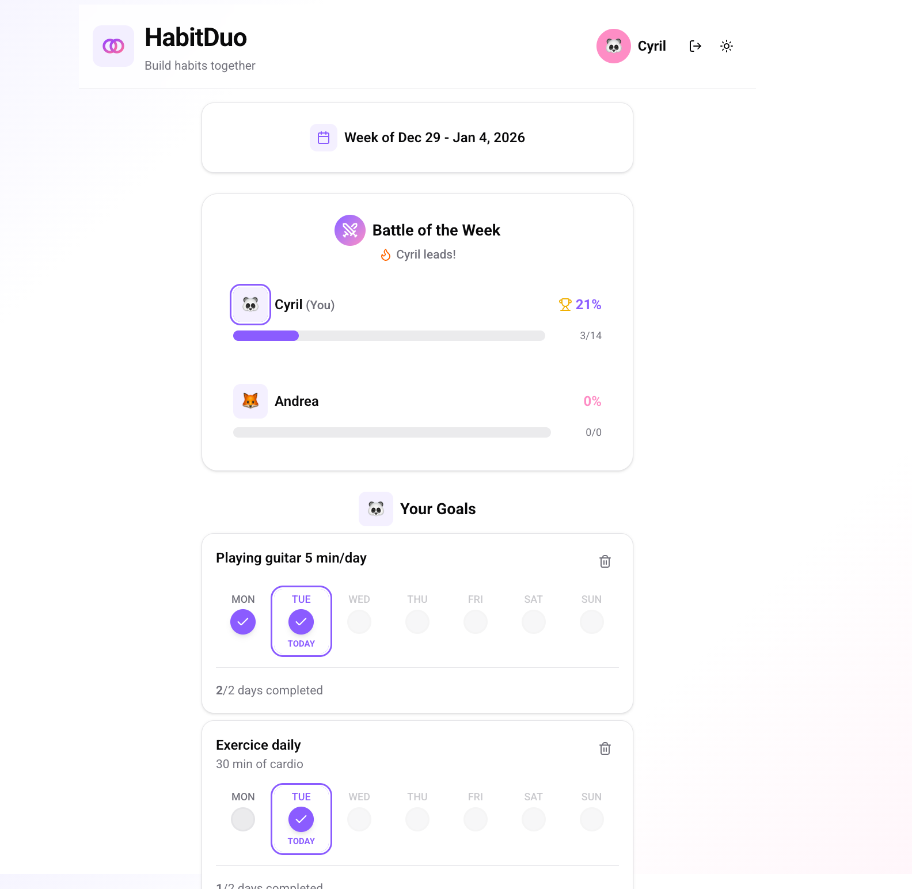

[![Personal Website][personal-website-shield]][personal-website-url]
[![Mail][personal-email-shield]](mailto:cyrilo.dev@gmail.com)
[![LinkedIn][linkedin-shield]][linkedin-url]
[![MIT License][license-shield]][license-url]

<br/>

<p align="center">
  
</p>

<h1 align="center">🌸 Flower Metal 🌸</h1>
<h3 align="center">Metal with flowers. Not hate.</h3>

<p align="center">
  A lightweight exploration of a community-made dataset on metal bands.
</p>

---

## Table of Contents

- [About the Project](#about-the-project)
- [Features](#features)
- [Built With](#built-with)
- [Getting Started](#getting-started)
- [License](#license)
- [Contact](#contact)

---

## About the Project

Flower Metal is a small web project that visualizes a **community-curated dataset** listing metal bands and their perceived proximity to far-right, Nazi, or anti-fascist positions.

This site **does not verify or update the data** — it simply makes it easier to browse the dataset and form your own conclusions.

📄 **Original Data Source:**
[View the community spreadsheet](https://docs.google.com/spreadsheets/u/0/d/e/2PACX-1vSfnVZGsyxn5eEacXKJZk3-_ql3bQAkPqzdc8p3fCdxtPS9BtvNlj0yjskUQyy3eDYBL9yYTqbba_5q/pubhtml?pli=1)

---

## Features

- 🔍 **Real-time search** across band names, countries, and explanations
- 🏷️ **Category filtering** by Black Metal, Other Genres, Record Labels, or All
- 🌓 **Dark/Light theme** support with system preference detection
- 📱 **Fully responsive** with mobile-optimized UI
- 📊 **Live data** fetched from Google Sheets (cached hourly)
- ⚡ **Fast performance** with Next.js Server Components

---

## Built With

- [Next.js](https://nextjs.org/)
- [React](https://reactjs.org/)
- [TypeScript](https://www.typescriptlang.org/)
- [Tailwind CSS](https://tailwindcss.com/)
- [shadcn/ui](https://ui.shadcn.com/)
- [Lucide Icons](https://lucide.dev/)

---

## Getting Started

### Prerequisites

- Node.js 20.x or higher
- pnpm (or npm/yarn)

### Installation

1. Clone the repository:

```bash
git clone https://github.com/Banaanas/flower-metal.git
cd flower-metal
```

2. Install dependencies:

```bash
pnpm install
```

3. Run the development server:

```bash
pnpm dev
```

4. Build for production:

```bash
pnpm build
```

The app will be available at [http://localhost:3000](http://localhost:3000)

---

## License

Distributed under the MIT License. See <a href="./LICENSE">LICENSE</a> for details.

---

## Contact

[![Personal Website][personal-website-shield]][personal-website-url]  
[![Mail][personal-email-shield]](mailto:cyrilo.dev@gmail.com)  
[![LinkedIn][linkedin-shield]][linkedin-url]

---

[personal-website-shield]: https://img.shields.io/badge/-Cyrilo-f04328?style=flat&logo=data:image/svg+xml;base64,PD94bWwgdmVyc2lvbj0iMS4wIiBlbmNvZGluZz0iaXNvLTg4NTktMSI/PjxzdmcgdmVyc2lvbj0iMS4xIiBpZD0iQ2FwYV8xIiB4bWxucz0iaHR0cDovL3d3dy53My5vcmcvMjAwMC9zdmciIHhtbG5zOnhsaW5rPSJodHRwOi8vd3d3LnczLm9yZy8xOTk5L3hsaW5rIiB4PSIwcHgiIHk9IjBweCIgdmlld0JveD0iMCAwIDUxMi4wMDEgNTEyLjAwMSIgc3R5bGU9ImVuYWJsZS1iYWNrZ3JvdW5kOm5ldyAwIDAgNTEyLjAwMSA1MTIuMDAxOyIgeG1sOnNwYWNlPSJwcmVzZXJ2ZSI+PGc+PGc+PHBhdGggZD0iTTUwMy40MDIsMjI4Ljg4NUwyNzMuNjg0LDE5LjU2N2MtMTAuMDgzLTkuMTg5LTI1LjI4OC05LjE4OC0zNS4zNjctMC4wMDFMOC41OTgsMjI4Ljg4NmMtOC4wNzcsNy4zNi0xMC43NDUsMTguNy02Ljc5OSwyOC44ODljMy45NDcsMTAuMTg5LDEzLjU1NywxNi43NzIsMjQuNDg0LDE2Ljc3MmgzNi42OXYyMDkuNzIxYzAsOC4zMTUsNi43NDIsMTUuMDU3LDE1LjA1NywxNS4wNTdoMTI1LjkxNGM4LjMxNSwwLDE1LjA1Ny02Ljc0MSwxNS4wNTctMTUuMDU3VjM1Ni45MzJoNzQuMDAydjEyNy4zMzdjMCw4LjMxNSw2Ljc0MiwxNS4wNTcsMTUuMDU3LDE1LjA1N2gxMjUuOTA4YzguMzE1LDAsMTUuMDU3LTYuNzQxLDE1LjA1Ny0xNS4wNTdWMjc0LjU0N2gzNi42OTdjMTAuOTI2LDAsMjAuNTM3LTYuNTg0LDI0LjQ4NC0xNi43NzJDNTE0LjE0NywyNDcuNTg1LDUxMS40NzksMjM2LjI0Niw1MDMuNDAyLDIyOC44ODV6IiBmaWxsPSIjZjhmOGZmIi8+PC9nPjwvZz48Zz48Zz48cGF0aCBkPSJNNDQ1LjA5Miw0Mi43M0gzNDMuOTczbDExNi4xNzYsMTA1LjYzNnYtOTAuNThDNDYwLjE0OSw0OS40NzEsNDUzLjQwOCw0Mi43Myw0NDUuMDkyLDQyLjczeiIgZmlsbD0iI2Y4ZjhmZiIvPjwvZz48L2c+PGc+PC9nPjxnPjwvZz48Zz48L2c+PGc+PC9nPjxnPjwvZz48Zz48L2c+PGc+PC9nPjxnPjwvZz48Zz48L2c+PC9zdmc+
[personal-website-url]: https://cyrilo.dev
[personal-email-shield]: https://img.shields.io/badge/-Cyril-ffb6c1?style=flat&logo=Gmail
[linkedin-shield]: https://img.shields.io/badge/-Cyril-blue?style=flat&logo=linkedin&
[linkedin-url]: https://www.linkedin.com/in/cyril-dev/
[license-shield]: https://img.shields.io/badge/License-MIT-limegreen.svg
[license-url]: LICENSE
